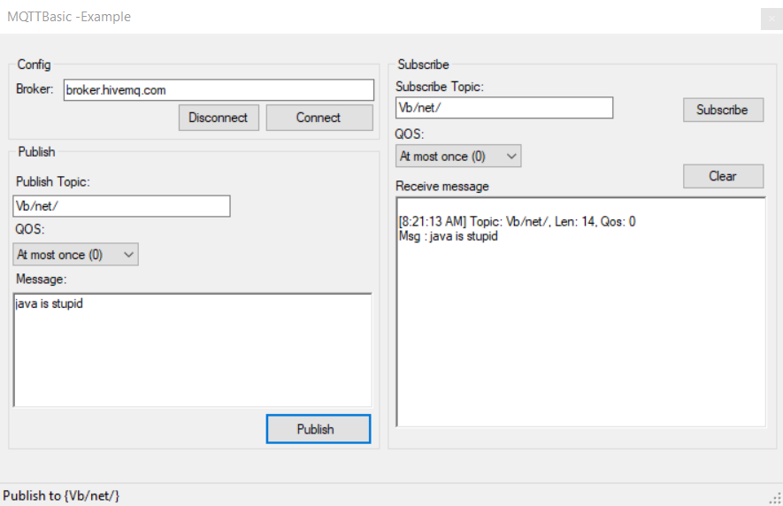

# MQTTBasic

This project is an example of how to use M2Mqtt library with VB.NET
In this example I attached the main features of the library (Connection, subscription, Publish)

M2Mqtt Description:

M2Mqtt is a MQTT client available for all .Net platforms (.Net Framework, .Net Compact Framework and .Net Micro Framework) and WinRT platforms (Windows 8.1, Windows Phone 8.1 and Windows 10) for Internet of Things and M2M communication.

MQTT, short for Message Queue Telemetry Transport, is a light weight messaging protocol that enables embedded devices with limited resources to perform asynchronous communication on a constrained network.

MQTT protocol is based on publish/subscribe pattern so that a client can subscribe to one or more topics and receive messages that other clients publish on these topics.

The project has an official website here : https://m2mqtt.wordpress.com/

The binaries for all platforms are also available as package from Nuget web site https://www.nuget.org/packages/M2Mqtt/

